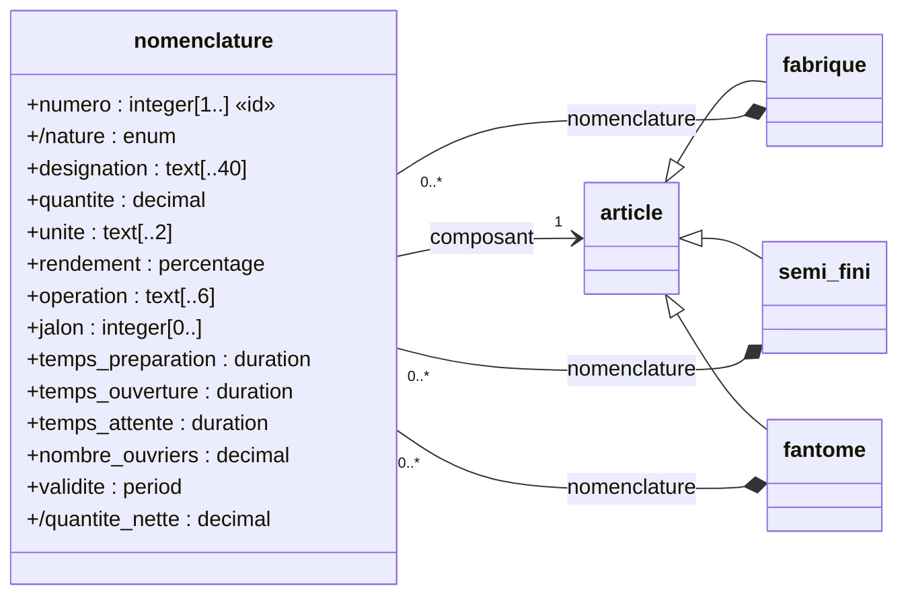

# La documentation générée par Syncytium

Ce document rassemble **les principes de la génération de la
documentation** : ce que Syncytium produit depuis la configuration,
pour qui, à partir de quoi, sous quelle forme, et ce que le technicien
peut y ajouter. C'est le quinzième artefact préparatoire de la
documentation (Q58, le domaine 6 — D602), après
[configuration.md](configuration.md) (D994) et
[migration.md](migration.md) (D1028) ; il est ouvert le 04/10/2026
(D1118). **Il centralise les principes ; chaque artefact garde ce que
son élément apporte à la documentation** — l'entité et ses champs dans
[entity.md](entity.md), les hooks et leur `describe` dans
[hooks.md](hooks.md), les connecteurs dans
[connectors.md](connectors.md), les dépendances dans
[security.md](security.md), les rapports de la reprise dans
[migration.md](migration.md). Les décisions citées renvoient à la
[conception](conception.md). Les sections marquées *en proposition*
sont miennes, jusqu'à leur arbitrage.

## Le contexte — les sept documentations (D1131)

Le 06/10/2026, l'auteur pose le contexte :

> « Une documentation d'abord fonctionnelle pour les utilisateurs, une
> documentation générale, des parties spécialisées avec des modes
> opératoires et des personas ; une documentation technique pour
> accéder à l'information (BI ou IA) comme le modèle de données, les
> règles et les données ; une documentation développeur pour utiliser
> les API, pour enrichir l'application et/ou pour étendre les
> composants disponibles ; une documentation d'architecture technique
> pour présenter les connexions entre l'application et son
> environnement ; une documentation réglementation (type RGPD) avec un
> référencement des données disponibles et des traitements liés ; une
> documentation promotionnelle pour exposer et vendre une application ;
> une documentation dédiée à la maintenance, à l'analyse des risques et
> à la recherche d'améliorations. »

**Sept documentations, puis neuf** — elles précisent les trois de
D333 : la fonctionnelle reste la première ; la technique se dédouble
(l'information, le développeur, l'architecture) ; trois naissent (la
réglementation, la promotion, la maintenance). Les arbitrages du
06/10 en ajoutent deux : **le projet et le support** (D1133) et **le
guide d'exploitation**, distinct du D.A.T. (D1134). Les masques (D209)
et les pièces de §14 à §25 sont des **formes** au service de ces neuf.
Les quatre parties qui suivent répondent aux quatre demandes du jour.

### 1. Le balayage — d'autres thèmes ?

Les sept couvrent ce que les décisions ont décrit. Quatre compléments :

- **la documentation du projet et du support** — le cycle de vie des
  versions (la promotion, la dépréciation, le Sunset — D340/D650), les
  notes de version, comment signaler une anomalie ou demander une
  évolution, le dépôt du client (D336) ; l'exemple de référence l'a
  (Procédures, Road map, F.A.Q.) — la F.A.Q., elle, est devenue une
  fonctionnalité du socle (§25, D1132). **La huitième documentation —
  acté** (D1133 : « le projet et le support est bien une huitième
  documentation ») ;
- **la formation** — un *usage* de la fonctionnelle plus qu'un type :
  les planches (§24), le parcours guidé (§19), les scénarios (§22)
  comme supports pédagogiques (D1129 — « le papier est une source de
  formation ») ; peut-être des exercices sur une instance d'essai ;
- **le D.A.T. et le guide d'exploitation — deux documentations, acté**
  (D1134) : « intimement liés mais [ils] couvrent des fonctions et des
  attendus distincts. Le D.A.T. est vu comme une description des
  inter-connexions entre l'application et son environnement + l'ensemble
  du paramétrage externe à l'application mais indispensable à son
  fonctionnement. Le guide d'exploitation explique l'installation, la
  configuration, la supervision et les opérations de maintenance. » Le
  D.A.T. est la quatrième documentation ; le guide d'exploitation (§17)
  **la neuvième** ; la septième garde l'analyse — les risques, les
  améliorations — et s'appuie sur les opérations que le guide explique
  (*ma lecture*) ;
- **la réglementation au-delà du RGPD** — l'accessibilité des écrans
  générés, les obligations légales du secteur (la conservation, la
  facturation), la sécurité comme obligation (les accès journalisés —
  D43, les dépendances — D924) : la cinquième s'élargirait en
  « réglementation et sécurité ».

### 2. Le classement — les sections et les pièces par documentation

| La documentation | Pour qui (§3) | Ce que ce document en dit déjà |
|---|---|---|
| **1. Fonctionnelle** — d'abord | l'utilisateur, le décideur | §6 la fonctionnelle (D1121 — les descriptions, les enchaînements, les opérations) ; §7 les masques ; §16 les enchaînements ; §19 le parcours guidé ; §22 les scénarios par personas ; §24 les modes opératoires ; §25 l'assistance — les questions et les réponses ; §14 l'export et l'import (le gabarit, la procédure) ; §15 le dictionnaire (par libellés) ; §5 la vue d'ensemble du modèle ; §9 les notes de version |
| **2. Technique — l'information (BI, IA)** | le technicien, l'assistant IA, le décideur | §4 la technique (le modèle, les règles) ; §5 le modèle de données ; §15 le dictionnaire (par noms) ; §8 les données ; §9 les écarts calculés ; §2 le carburant ; la reprise ([migration.md](migration.md)) ; le chat (D957) |
| **3. Développeur** | le technicien tiers, le technicien de l'application | §10 l'API ; §4 chapitres 7–9 — les types personnalisés, les connecteurs, les hooks ; §14 les formats d'échange |
| **4. Le D.A.T. — l'architecture technique** : les inter-connexions et le paramétrage externe indispensable (D1134) | l'administrateur, le technicien | §4 chapitre 1 — les environnements et les connecteurs ; §4 chapitre 11 — les dépendances ; les secrets et les variables (D944/D321) |
| **5. Réglementation** | l'usager, le DPO, l'administrateur | §18 la conformité — le registre (D698), la matrice des droits, la sécurité de l'instance |
| **6. Promotionnelle** | le prospect, le dirigeant | rien encore — la seule à faire naître |
| **7. Maintenance, risques, améliorations** — l'analyse | l'administrateur, le technicien, le décideur | §23 les contrôles et la supervision, les optimisations ; §8 les données ; §20 la complétude ; §9 les écarts (le risque d'une version) |
| **8. Le projet et le support** (D1133) | le dirigeant, l'administrateur, l'utilisateur | §9 les notes de version ; le cycle de vie des versions (D340/D650/D1123–D1124) ; le dépôt du client (D336) ; signaler, demander — rien de rédigé encore |
| **9. Le guide d'exploitation** : l'installation, la configuration, la supervision, les opérations de maintenance (D1134) | l'administrateur | §17 le guide d'exploitation ; §23 les opérations de maintenance |
| *le socle de la génération* — transversal | — | §1 le principe ; §2 le carburant ; §3 les lecteurs ; §11 les formats ; §12 `documentation.yml` ; §13 le tiny et la méthode ; §21 la diffusion |

### 3. Les compléments — ce qui n'est pas encore décrit

**1. Fonctionnelle.** *La documentation générale* — la présentation de
l'application : l'entreprise, ce que l'application sert, les modules
et le schéma directeur (l'exemple de référence : « Présentation ») —
en textes complémentaires (D1122) ; *l'assistance* — les questions des
utilisateurs et leurs réponses, une fonctionnalité du socle (§25,
D1132), que complètent les messages de validation expliqués
(« pourquoi ce message ? » — D1116) ; *« mes droits »* — ce que
l'utilisateur peut faire, par
groupe ; *les notifications* — quand et pourquoi un mail arrive
(D108) ; *les documents produits* — les impressions et leurs gabarits
(D53) ; *la recherche* — ce qui se cherche et comment (D780).

**2. Technique — l'information.** *Une édition lisible par la
machine* — le méta-schéma et ses descriptions exportés (JSON ou YAML)
pour les outils de BI et pour l'IA : le mode d'emploi filtré par les
droits de D958, matérialisé ; *le modèle physique* — les tables et les
colonnes du storage par le `describe()` du connecteur (D630), la
correspondance du nom logique au stockage ; *les règles en un lieu* —
les validations, les calculés et leurs formules, les états, les
automatismes ; *l'historique* — comment lire les instantanés
(D168–D173) ; *les volumes et la diversité* par entité (D38–D39) ;
*l'accès pour la BI* — la lecture paginée (D22), l'export, les clés et
les identités.

**3. Développeur.** *Le contrat d'API* par version publiée (D99) :
l'authentification des comptes techniques (D28), l'épinglage (D98), la
pagination et les lots (D22), les tâches asynchrones (D24), les champs
exposés (D20), les erreurs (le 426 — D94), des exemples d'appel ;
*étendre* — les cinq familles de hooks ([hooks.md](hooks.md)) : écrire
un hook, son md (D778), la librairie d'exploration (D572/D599), le hook
d'interface listé (D918) ; les types et les composants personnalisés
(D359, D452) ; *enrichir* — la syntaxe de la configuration et le dépôt
du client (D336), le cycle des versions (D340) : c'est ici que la
documentation de référence de Syncytium entre (le point ouvert 11).

**4. Le D.A.T.** *Le schéma des connexions* — un diagramme calculé,
comme le modèle (D1119) : l'instance, son storage, l'authentification,
le SMTP, les bases d'origine de la reprise, les webhooks et les API
tierces, le LLM (D957), les postes ; *les environnements* et leur rôle
(production, staging, passif — D339, D112–D114), les flux et les ports
; **le paramétrage externe indispensable** (D1134) — les variables
d'environnement et les secrets (D321/D944/D902 : où ils vivent, qui les
tient), les comptes techniques chez les tiers (le fournisseur
d'identité, le SMTP, le LLM), les certificats (D919), les accès aux
bases d'origine, le DNS, le pare-feu ; le dimensionnement (D15) ; les
dépendances (D924). *Ce que la configuration sait* (les connecteurs et
leurs paramètres) se génère ; *ce qui est hors d'elle* (les comptes,
le réseau) s'écrit (D1122).

**5. Réglementation.** *Le registre complet* — par traitement, la
finalité et la base légale (écrites — D1122), les données et leur
confidentialité (calculées), les destinataires (les groupes, les
connecteurs sortants), les durées et l'anonymisation à l'échéance
(D696/D698), les transferts (le fournisseur du LLM) ; *les droits des
personnes* — comment l'application les sert (l'accès, la rectification,
l'effacement) ; *les mentions d'information* ; *la journalisation des
accès* (D43) ; au-delà, l'accessibilité et les obligations du secteur.

**6. Promotionnelle.** À faire naître : *la plaquette* — le nom, la
description, les modules (`title:`, `description:`), le modèle
d'ensemble en image, les écrans rendus, les personas et leurs scénarios
comme cas d'usage, « quoi de neuf » (les notes de version) ; *la
démonstration* — une instance d'essai et son jeu de données (D869) ;
*l'argumentaire du socle* — l'open source AGPL (D19), une instance par
client, les API, l'auto-documentation. Le ton et les textes sont écrits
(D1122) ; la structure et les visuels, générés.

**7. Maintenance, risques, améliorations — l'analyse.** §23 (ses
contrôles, sa supervision, ses optimisations — ses opérations
s'expliquent au guide d'exploitation, 9), et *l'analyse des risques* : le dry-run d'une version (le risque de migration — D737),
les anomalies de la reprise, les validations en échec, les refus et les
pics (D43), les versions dépréciées encore appelées (D742), les
dépendances vulnérables (D924 — la veille hors moteur), la sauvegarde
et le PRA (D112–D114), les volumes et la performance (D985/D1012) ; *la
recherche d'améliorations* : les conseils (D45), le champ constant et
le domaine surdimensionné (D46/D48), les écrans jamais ouverts, la
complétude (§20), les demandes des utilisateurs (le lien vers le suivi
du projet — l'exemple de référence : « Création d'un ticket »).

**8. Le projet et le support** (D1133). *Le cycle de vie* — les
versions, leurs statuts et leurs passages (D340 : beta, production,
dépréciée, interdite ; D650 le Sunset ; D1123–D1124 la documentation
de chacune), les notes de version (D1112), ce qui change (§9) ; *le
dépôt du client* (D336) — où vit la configuration, comment elle se
versionne ; *signaler et demander* — une anomalie, une évolution, où et
comment (le lien vers le suivi du projet — l'exemple de référence :
« Création d'un ticket », « Suivi du projet », « Dépôt GIT ») ; *le
support* — qui répond, dans quels délais ; l'assistance (§25) en est
le pendant dans l'application. La structure se génère (les versions,
les liens), les engagements s'écrivent (D1122).

**9. Le guide d'exploitation** (D1134). *Installer* — le moteur, le
storage, les connecteurs ; *configurer* — le `.env` et ses variables
(D321/D944), les environnements, le journal (D1091), le nettoyage
(D1073) ; *démarrer, arrêter, sauvegarder, restaurer* ; *superviser* —
le journal et ses niveaux, le tableau de bord, les alertes (D44), les
passages de la reprise ; *les opérations de maintenance* — la
promotion d'une version (D340), la copie d'un environnement (D1080),
la rotation du chiffrement (D1079), la relecture de la reprise (D943),
la restauration d'un enregistrement (D171) ; *dépanner* — les erreurs
connues et leur remède. §17 en est la maison ; ce que la configuration
déclare se génère, le reste s'écrit.

### 4. L'ordre — enrichir et valider ensemble

L'ordre tient compte des deux arbitrages du 06/10 — la huitième
documentation (D1133), le D.A.T. et le guide d'exploitation distincts
(D1134) — et est acté (D1135).

| Rang | Documentation | Ce qu'on y arbitre | Pourquoi là |
|---|---|---|---|
| 0 | *le socle de la génération* | §2, §3 (les lecteurs des neuf), §12, §13, §21 ; §11 renvoyé au domaine 7 | le cadre, vite |
| 1 | **Fonctionnelle** (1) | §6, §7, §16, §19, §22, §24, §25 (ses questions gardées), §14, §15 ; la générale, « mes droits » ; les neuf frottements du tiny | « d'abord fonctionnelle » ; le tiny la montre |
| 2 | **Technique — l'information** (2) | §4, §5, §8, §9 ; l'édition machine, le modèle physique, l'historique | tout en découle ; le tiny la montre |
| 3 | **Réglementation** (5) | §18 ; le registre complet, les droits des personnes | l'obligation de la TPE ; la matière est au modèle |
| 4 | **Le projet et le support** (8) | le cycle de vie, le dépôt, signaler et demander, le support | la matière est acquise (D340, D650, D1112, D1123) ; peu à arbitrer, et le cas 8 en aura besoin |
| 5 | **Développeur** (3) | §10 ; les hooks, l'extension, la syntaxe (le point 11) | les techniciens tiers du cas 8 ; la forme attend le domaine 7 |
| 6 | **Le D.A.T.** (4) | le schéma des connexions, les environnements, le paramétrage externe | dépend des choix techniques (D1025) |
| 7 | **Le guide d'exploitation** (9) | §17 ; installer, configurer, superviser, les opérations | dépend des mêmes choix, et du D.A.T. |
| 8 | **Maintenance, risques, améliorations** (7) | §23 ; l'analyse des risques | dépend de la télémétrie et de l'instance |
| 9 | **Promotionnelle** (6) | la plaquette, la démonstration, l'argumentaire | réemploie les huit autres ; les textes sont à écrire |

Le document garde ses sections numérotées jusqu'à la fin des
arbitrages ; **le regroupement physique par documentation** viendra
avec la documentation structurée (D1021), quand les numéros n'auront
plus à servir de repères.

## 1. Le principe — trois documentations, trois sources, une seule version

**« La description et l'autogénération de la documentation sont un
des piliers du projet »** (D810). Le méta-schéma et la configuration
construisent en automatique, autant que possible (D333) :

1. **une documentation technique** — ce que l'application est : son
   modèle, ses règles, ses droits, ses connecteurs, ses hooks, ses
   dépendances, ses versions ;
2. **les masques d'explication** (D209) — l'aide en ligne tissée dans
   l'application : la description de la surface et celles des champs
   affichés, à la première consultation ou sur sollicitation ;
3. **une documentation fonctionnelle** — ce que l'application fait,
   pour celui qui s'en sert : **elle exploite les descriptions, les
   enchaînements et les opérations** (D1121) ; **une partie en est
   intégrée à l'expérience utilisateur** — les masques en sont la
   forme première.

Elle a **trois sources** (D1122) :

1. **les fichiers de configuration** — le modèle, dont le moteur
   déduit la base de la documentation sans qu'on l'écrive (les types et
   leurs facettes, les validations, les droits, le modèle de données en
   diagrammes — D1119, les écarts entre versions — D1112, le registre
   des traitements — D698, les dépendances — D924), et **les items qui
   complètent ce que le modèle ne dit pas** : `title:`, `hint:`,
   `description:`, `placeholder:`, les notes de version (D810,
   D124/D258/D840, D1112, D1120) ;
2. **les fichiers complémentaires** que la configuration référence
   (D767/D956) — une image, une description longue, des explications :
   le md du fonctionnement d'un hook (D778), les ressources (D346) ;
3. **les données de l'instance** (D334) — l'usage ou le non-usage des
   valeurs et des plages, la télémétrie (D38–D51, la diversité
   D46/D48) : **le modèle dit ce qui est permis, la base dit ce qui est
   fait**.

La documentation rédigée du projet Syncytium — les artefacts de
`docs/` — n'est pas une source de la documentation de l'application ;
ce que D645 lui demandait d'en porter (« la documentation technique de
Syncytium ») reste à placer (§26).

Et une règle qui les tient ensemble : **chaque version active porte sa
documentation** (D1123 — D645/D810) ; *la version documentée est
exactement la version servie*. **Les versions actives sont celles de
`beta/` et de `production/`** (D1124) ; **une version dépréciée n'a plus
de documentation** : la sienne dit qu'elle n'est plus disponible et
**renvoie à la liste des versions disponibles, présentée par leurs
notes de version**. **Par défaut, la documentation disponible est celle
de la version la plus élevée** ; chaque version décrit l'état à cette
version, et **les éléments antérieurs peuvent s'y ajouter en
annotation** (les écarts, §9). Rien à rédiger à part, rien à oublier :
elle vit avec le modèle et ne se périme jamais (D333). **Par défaut,
sans configuration** (D1090) : `documentation.yml` ne vient que pour la
personnaliser.

**Ce que la documentation comprend** (D1125 — « les principes posent
les types de documentation et les points ci-dessus ») : outre les trois
documentations et le modèle de données en diagrammes (§5), dix pièces,
chacune détaillée dans sa section — **l'export et l'import** (§14), **le
dictionnaire des données** (§15), **les enchaînements** (§16), **le guide
d'exploitation** (§17), **la conformité** (§18), **le parcours guidé**
(§19), **la complétude de la documentation** (§20), **la diffusion**
(§21), **les scénarios d'utilisation par des personas** (§22 — D1127 ;
le plan de test de l'exemple de référence est écarté), **la
maintenance, les contrôles et la supervision** (§23 — D1128), **les
modes opératoires imprimables** (§24 — D1129), **l'assistance — les
questions, les réponses, les commentaires** (§25 — D1132, une
fonctionnalité du socle). L'auteur garde la possibilité d'ajouter
d'autres pièces.

Ses lecteurs ne sont pas que des humains : les descriptions sont
**« exploitables par des IA »** (D124) — le module de chat lit les
données et les descriptions sous les droits de l'utilisateur (D957), le
cas 7 fait générer la configuration par l'IA (D1023).

## 2. Le carburant — ce que la configuration apporte

Tout élément de configuration porte sa description, en ligne ou par
fichier (D810/D767). **Ce que la documentation doit porter s'écrit en
propriété, jamais en commentaire** (D1100) : le commentaire YAML est
pour le lecteur du fichier, la propriété pour la documentation.

| L'élément | Ce qu'il apporte | Décisions |
|---|---|---|
| le projet (`syncytium.yml`) | `name:`, `description:` ; la version du format `from:` ; le dossier `resources/` (logos, icônes) | D322, D346, D1083 |
| l'environnement | sa `description:` (la nature : la vie courante, le développement), son `storage:`, ses connecteurs | D1090, D1094 |
| la version | les `release-notes:` — **l'évolution fonctionnelle, écrite par le technicien** ; les `languages:` ; les écarts calculés par Syncytium | D1101, D1112 |
| le module | `name:` l'invariant ; `title:` le nom d'usage par langue, `hint:`, `description:` | D416, D1120 |
| l'entité | `name:` l'invariant ; `title:` le nom d'usage par langue ; `label:` (le gabarit du visage), `hint:`, `description:`, l'identité, les états et leur graphe, les validations (`description:`/`message:`), l'historisation, le `rgpd:` | D843, D1116, D1120 |
| le champ | le type et ses facettes, `label:`, `hint:` (la courte), `description:` (la longue, en Markdown — D1102), `placeholder:`, `required:`, `default:`, les validations, la confidentialité, les `allow:`, le `rgpd:`, `unchanged:`, `from:` (le renommage), `deprecated:` (le remplacement ou l'abandon, obligatoire) | D124, D258, D650, D840, D941, D1111 |
| les opérations | leur `description:`, leur contrat et son degré | D148–D152, D699 |
| les surfaces (`gui:`) | la `description:` de la surface → le masque d'explication | D209, D438 |
| les groupes | la `description:` affichée | D414, D1099 |
| les connecteurs | `description:` + `describe()` — ce que la classe dit d'elle-même | D630 |
| les hooks | `describe()` + le fichier md du fonctionnement ; **le hook d'interface est listé** pour que l'administrateur sache quel code tourne chez ses utilisateurs | D645, D778, D918 |
| la reprise | la `description:` des sources et de leurs colonnes (D1100–D1102), celle des règles et de leurs affectations (D1105) | D1100–D1106 |
| le moteur | ses dépendances et leurs versions | D924 |

**Les textes par langue** (D1101) : une seule langue au modèle → les
textes en texte simple ; plusieurs → la langue précisée, sinon une
erreur d'ingestion. La documentation suit : *une édition par langue
déclarée* (ma lecture, §11).

## 3. Les lecteurs *(en proposition)*

D334 nomme quatre destinataires au-delà du technicien : **les
utilisateurs, les techniciens de parties tierces, les usagers**, et
pose le principe du partage **sous les règles d'accès existantes** —
le destinataire ne voit que ce que ses droits permettent
(l'interprétation consignée à D334). D1119 ajoute **le décideur**, qui
perçoit le modèle sans en lire les tables. Je lis sept lecteurs :

| Le lecteur | Ce qu'il cherche | Où il le trouve |
|---|---|---|
| **le technicien** de l'application | le modèle complet, les règles, les écarts entre versions, les hooks, la reprise | la documentation technique |
| **l'administrateur** | les connecteurs et leur état, les dépendances, le code tiers servi au navigateur, le registre des traitements, les groupes et les droits | la documentation technique — la part d'exploitation |
| **l'utilisateur** (l'opérateur) | ce que fait chaque écran, chaque champ, chaque opération, dans sa langue ; le modèle de son module, en image ; **la procédure sur une page, posée sur le bureau** — tous n'exploitent pas le numérique (D1129) | les masques d'explication, la documentation fonctionnelle, les modes opératoires imprimés |
| **le décideur** | ce que l'application couvre, comment les choses se tiennent — en une image | la vue d'ensemble du modèle (§5), les notes de version |
| **le technicien tiers** (le consommateur des API) | le contrat de chaque version publiée, les champs exposés, les exemples d'appel | la documentation de l'API |
| **l'usager** (la personne dont les données sont traitées) | ce que l'application sait d'elle, pourquoi, combien de temps | le registre des traitements, sous l'angle RGPD |
| **l'assistant IA** | le mode d'emploi filtré par les droits, les descriptions | la même matière, servie au chat (D957–D958) |

Une seule matière, des vues : **la documentation n'est pas un document,
c'est une projection de la configuration pour un lecteur et des
droits** — la même machinerie que la télémétrie (D44 : « Syncytium se
décrit lui-même »).

## 4. La documentation technique *(le plan, en proposition)*

Ce que l'application est, à une version donnée. Les noms sont ceux de
la configuration (la langue du modèle — D335), les types ceux du
catalogue.

1. **Le projet** — le nom, la description, la version du format, les
   environnements et ce que chacun câble (le storage, les
   connecteurs — sans leurs secrets, D944).
2. **La version** — le numéro, le statut (son dossier — D338/D340),
   les langues, les notes de version, **les écarts avec la version
   précédente, calculés** (§9).
3. **Le modèle de données** — la vue d'ensemble en diagramme (§5) :
   les entités, groupées par module, et leurs liens.
4. **Les modules** — pour chacun, sa vue du module (§5), ses entités,
   son menu, ses tableaux de bord.
5. **Les entités** — pour chacune : la description, l'identité, le
   visage (`label:`), **sa vue de l'entité** (§5), les états et leur
   graphe, l'historisation, le `rgpd:` ; **la table des champs** (le
   nom, le type et ses facettes, le libellé, l'aide, l'obligation, le
   défaut, la confidentialité, les droits d'écriture) ; les champs
   calculés et leur formule ; les validations (la règle, sa
   description, son message) ; les opérations et leur contrat ; les
   surfaces déclarées.
6. **Les groupes et les droits** — la composition (D1099), le degré
   (D699), la matrice entités × groupes × actions.
7. **Les types personnalisés** (`settings.yml`) et les réglages.
8. **Les connecteurs** — chacun par son `describe()`.
9. **Les hooks** — chacun par son `describe()` et son md ; les hooks
   d'interface signalés (D918).
10. **La reprise** — les sources lues et ignorées, leurs colonnes
    décrites, les règles et leurs destinataires (migration.md).
11. **L'exploitation** — le journal, le nettoyage, les opérations
    périodiques, les dépendances du moteur (D924), le registre des
    traitements (D698).
12. **L'API** — le contrat de la version pour le technicien tiers (§10).

## 5. Le modèle de données — la représentation graphique (D1119)

**« Il faut ajouter un volet "modèle de données" de type UML pour
faciliter la lecture » ; « le modèle de données, au-delà d'une
description littérale, est à représenter graphiquement pour que le
modèle soit facilement perceptible par un opérateur ou un
décideur. »** (l'auteur, le 04/10/2026). Le modèle se lit donc deux
fois : en tables (§4) et en diagrammes — et le diagramme s'adresse
aussi à ceux qui ne liront jamais la table.

**Acquis** : un volet « modèle de données », graphique, de type UML,
**calculé depuis la configuration** — rien à dessiner, le modèle est
déjà là (le patron des écarts, D1112) ; pour le technicien,
l'opérateur et le décideur.

*En proposition :*

**Le diagramme de classes, en trois niveaux de lecture.**

| Le niveau | Ce qu'il montre | Pour qui | Où |
|---|---|---|---|
| **la vue d'ensemble** de la version | une boîte par entité, groupée par module (le paquetage) ; les liens — l'héritage, la composition, la référence ; **ni champ, ni nom de lien** ; **un seul trait entre deux entités**, quel que soit le nombre de champs qui les relient | le décideur ; l'opérateur qui découvre | en tête de la documentation fonctionnelle et de la technique (§4, chapitre 3) |
| **la vue du module** | ses entités avec leurs champs ; les entités des autres modules qu'il référence, en boîtes vides marquées de leur module | l'opérateur du module ; le technicien | le chapitre du module |
| **la vue de l'entité** | l'entité et son voisinage immédiat : son parent et ses dérivés, ses compositions, ce qu'elle référence, ce qui la référence, ses associations dérivées, les noms des liens | le technicien ; l'opérateur, pour une entité | le chapitre de l'entité |

**La correspondance** (la table détaillée, propriété par propriété,
dans [entity.md](entity.md)) : le module → le paquetage ; l'entité →
la classe, le parent abstrait en italique (D1035) ; `inheritance:` →
la généralisation ; le champ → l'attribut `nom : type` ; la
confidentialité → **la visibilité UML** (`+` public, `#` protected, `-`
private — D358) ; `formula:` → **l'attribut dérivé** `/nom` ;
`identity:` → les attributs marqués `{id}` ; `type: <entité>` →
l'association dirigée, `1` ou `0..1` selon `required:` ; `type: list of
<entité>` → **la composition** `0..*` ; `type: association with …` →
l'association dérivée, en pointillé, `/nom` — aux vues du module et
de l'entité seulement ; les opérations → le compartiment des
opérations ; `states:` → **un diagramme d'états** à part, les valeurs
du statut et les passages permis (D422) — le véhicule (cas 3) en a un.

**L'édition fonctionnelle** (§6) montre les mêmes diagrammes avec les
libellés des champs à la place des noms, sans les types ni les
visibilités ; **l'édition technique** (§4) les montre tels quels.

**La forme dépend de l'architecture technique et des modes de rendu**
(D1126) : ce document dit ce que le diagramme montre, pas comment il
se dessine. Les exemples ci-dessous sont écrits en Mermaid
(`classDiagram`) parce qu'un texte de diagramme se lit dans le dépôt et
se rend sur GitHub ; l'outil — Mermaid, PlantUML, un SVG calculé —
se choisit au domaine 7.

**Le nom d'usage — `title:` (D1120).** `name:` est l'invariant du
module et de l'entité, quelle que soit la langue (D124/D335) ; `label:`
le gabarit d'*un enregistrement* (« `{code} — {libelle}` »). **`title:`
et `description:`, déclinés par langue, complètent `name:`** : le
`title:` est le texte que montrent l'entrée de menu par défaut (D186),
la vue d'ensemble fonctionnelle et les titres de la documentation —
« Produit fabriqué », « Ligne de nomenclature » ; texte simple à une
langue, par langue à plusieurs (D1101) ; sans lui, le `name:`. *Mes
lectures* : au singulier, le pluriel n'est pas une propriété ; le même
`title:` que celui des surfaces.

**La vue d'ensemble du cas 5**, telle que Syncytium la calculerait —
dix-huit entités, quatre paquetages, un trait par couple ; les
associations dérivées (`commandes_vente`, `mouvements`…) n'y figurent
pas. *(Écrit en Mermaid, non rendu : la syntaxe se valide au premier
rendu.)*

```mermaid
classDiagram
  direction LR
  namespace technique {
    class article
    class fabrique
    class semi_fini
    class fantome
    class nomenclature
  }
  namespace tiers {
    class tiers
    class client
    class fournisseur
    class adresse
    class contact
  }
  namespace commande {
    class commande_vente
    class ligne_vente
    class commande_achat
    class ligne_achat
  }
  namespace stock {
    class depot
    class emplacement
    class niveau
    class mouvement
  }
  article <|-- fabrique
  article <|-- semi_fini
  article <|-- fantome
  tiers <|-- client
  tiers <|-- fournisseur
  fabrique *-- "0..*" nomenclature
  semi_fini *-- "0..*" nomenclature
  fantome *-- "0..*" nomenclature
  nomenclature --> "1" article
  article --> "0..1" fournisseur
  article --> "0..1" depot
  article --> "0..1" emplacement
  fabrique --> "0..1" client
  tiers *-- "0..*" adresse
  tiers *-- "0..*" contact
  commande_vente --> "1" client
  commande_vente *-- "0..*" ligne_vente
  ligne_vente --> "1" article
  commande_achat --> "1" fournisseur
  commande_achat *-- "0..*" ligne_achat
  ligne_achat --> "1" article
  emplacement --> "1" depot
  niveau --> "1" article
  niveau --> "1" depot
  niveau --> "1" emplacement
  mouvement --> "1" article
  mouvement --> "0..1" depot
  mouvement --> "0..1" emplacement
```

**La vue de l'entité `nomenclature`** (le cas 5) — ses quinze champs,
l'identité, les deux calculés, ses trois possesseurs, l'article qu'elle
référence. *(UML écrit `{id}` ; Mermaid n'accepte pas l'accolade dans
une classe, l'exemple écrit `«id»`.)*



Le tiny (§13) donne la plus petite vue possible : le paquetage
`annuaire`, la classe `personne`, quatre attributs, deux `{id}`.

## 6. La documentation fonctionnelle *(en proposition)*

Ce que l'application fait, pour celui qui s'en sert — **trois
matières** (D1121) : **les descriptions** (`title:`, `hint:`,
`description:` — ce qu'est chaque chose), **les enchaînements** (le
menu et ses parcours — D189/D193, les états et leurs passages — D422,
les automatismes) et **les opérations** (les verbes et ce qu'ils font).
**Les libellés remplacent les noms, la langue de l'utilisateur remplace
celle du modèle** ; ni type, ni stockage, ni formule — ce qu'un champ
*est*, pas comment il se calcule. **Une partie s'intègre à l'expérience
utilisateur** (D1121) : les masques (§7), les aides en place — la
documentation lue à part et l'aide lue en place sont la même matière.

**L'exemple de référence** (D1126) : la documentation fonctionnelle de
DSP Gestion, l'application de l'auteur, en HTML. Ce qu'elle montre, et
ce que j'en retiens *(mes lectures)* :

- **son plan** — Présentation (l'entreprise, l'application, ses
  modules, **le modèle de données complet en une image, une couleur par
  module**), Fonctionnalités, Architecture technique, Installation et
  configuration, Procédures, Plan de test, Road map, F.A.Q. ;
- **les fonctionnalités s'ouvrent sur ce qui est commun** à tous les
  modules — l'écran principal et ses bandeaux, l'état de la connexion,
  le changement de module, le journal, le profil, **la procédure
  d'import CSV** (le fichier, la vérification, la validation, la
  création / modification / suppression des seules lignes qui
  changent), les notes de version dans l'application, **le cycle de vie
  d'une donnée** (la suppression qui marque sans effacer) — puis **un
  chapitre par module**, avec ses indicateurs et **le sous-modèle de
  chaque domaine** (les fournisseurs et les plats, les menus, les
  clients, les commandes, les tournées) : les trois niveaux de §5,
  avant la lettre ;
- **l'application mène à sa documentation** : un « ? » au niveau du
  module, un « ? » au niveau de la fonctionnalité, chacun ouvrant la
  page du wiki qui lui correspond — la part intégrée de D1121 prend la
  forme d'une **adresse** : chaque module et chaque surface a sa page,
  atteignable depuis l'écran, le masque (§7) en est le résumé en place ;
- ce qui est commun à toutes les applications — l'écran, l'import, le
  cycle de vie — **est la documentation du socle** : c'est là que « la
  documentation technique de Syncytium » de D645 trouverait sa place
  dans celle de l'application (le point ouvert 11) ;
- **le plan de test** — des scénarios Gherkin par entité (étant donné /
  quand / alors), le premier étant l'accès à la documentation depuis
  l'écran — est **écarté** par l'auteur et **remplacé par des scénarios
  d'utilisation de l'application par des personas** (D1127, §22).

- **L'application** — sa description, **la vue d'ensemble du modèle**
  (§5), ses modules et ce que chacun sert ; ce qui a changé à cette
  version : les notes de version (D1112), en langage d'usager.
- **Chaque module** — sa vue du module (§5), ses écrans (les listes,
  les formulaires, les tableaux de bord), dans l'ordre du menu.
- **Chaque écran** — sa description, les champs qu'il montre et leur
  aide (la matière du masque d'explication, posée), les opérations
  offertes et ce qu'elles font, les états et les passages permis.
- **Ce que l'utilisateur ne voit pas** n'y figure pas : la
  confidentialité et les droits filtrent la documentation comme ils
  filtrent l'écran (D334).

## 7. Les masques d'explication (D209)

Acquis : à la **première consultation ou sur sollicitation** d'une
surface — liste, formulaire, widget de résumé, widget de synthèse —, le
masque présente **la description de la surface** et **reprend les
descriptions des champs affichés** (D124) ; les descriptions déclarées
sont l'aide en ligne, sans rédaction séparée. La première consultation
se mémorise au profil (l'interprétation de D209). Le `hint:` (D840) est
l'aide courte, au « (?) » du champ, sur les trois écrans (D262).

*Mes lectures à confirmer* : le masque est **la documentation
fonctionnelle de l'écran, servie en place** — même matière, même
langue, mêmes droits ; une surface sans `description:` a tout de même
son masque, fait des aides des champs ; un champ sans `description:` y
paraît par son `hint:`, sinon par son libellé seul. Le même « ? »
montre les questions répondues de l'écran et permet d'en poser une
(§25, D1132).

## 8. La troisième source — les données (D334) *(en proposition)*

La documentation technique **exploite les données enregistrées** pour
dire l'usage : la part de valeurs renseignées d'un champ facultatif,
**les valeurs d'un `enum` jamais employées**, les plages réellement
occupées d'un numérique ou d'une date, la diversité représentative
(D46 — un champ constant, candidat au retrait) et scalaire (D48 — un
domaine surdimensionné, à resserrer). Elle ne vit qu'**avec
l'instance** : une documentation générée au dépôt, sans base, n'a pas
cette section ; la documentation servie par l'application l'a. *À
trancher* : sur quels types et quels indicateurs (la liste des canaux
de telemetry.md), et si cette part reste au technicien ou se partage.
Cette source nourrit la pièce §23 — la supervision des usages, les
contrôles, les optimisations.

## 9. Les écarts entre versions (D1112) *(la forme, en proposition)*

**Syncytium calcule les écarts et les présente ; le technicien ne les
décrit pas** — la description d'un champ dit ce qu'il est, jamais ce
qui a changé ; les notes de version disent le sens fonctionnel.
La documentation d'une version porte donc deux textes : *les notes de
version*, écrites, et *« ce qui change »*, calculé depuis la version
précédente du même statut ou de la chaîne (D4/D323) : les modules,
entités et champs **ajoutés**, **renommés** (`from:` — D1111),
**retypés**, **supprimés** ou **dépréciés** (D650 — avec leur
remplacement), les validations et les droits modifiés. Pour le
technicien tiers, la même liste dit ce que son contrat perd ou gagne
(D11–D13, D98–D99). **Les éléments antérieurs peuvent aussi s'ajouter en
annotation** dans la documentation de la version (D1123) — à côté du
champ : « renommé depuis `abrege` en 1.0.0.1 » — en plus de la liste ;
*ma lecture* : l'annotation est une option de la génération.

## 10. La documentation de l'API *(en proposition)*

D334 : « les techniciens de parties tierces — les consommateurs des
API, dont la documentation générée s'enrichit ». Pour chaque version
**publiée** (D99), la documentation donne, par entité : les champs
exposés (D20 — la politique d'exposition), les opérations, les
exemples d'appel — la lecture, la création, la modification, la
suppression, la recherche — tels que le tiny les montre (D1026),
l'épinglage de version (D98). **La forme** (un format standard de
description d'API, les exemples en `curl`) relève de l'architecture
technique (D1025) ; le principe — l'API documentée depuis le modèle,
version par version — est acquis.

## 11. Les formats et le support *(en proposition)*

- **Le format dépend de l'architecture technique et des modes de
  rendu** (D1126) : il se fixe au domaine 7. Ce document retient le
  principe — D630 : « markdown/html pour la documentation automatique
  de l'instance » —, l'exemple de référence est en HTML (§6), le PDF
  viendrait par l'impression (D53/D187) ; les diagrammes suivent (§5).
- **Deux moments** : *au dépôt* — depuis la configuration seule, par
  une commande (`syncytium document …`, à nommer), le résultat en
  fichiers dans un dossier (la documentation se diffe et se versionne
  avec le dépôt du client — D336) ; *dans l'application* — servie par
  l'instance, sous les droits du lecteur, enrichie des données (§8),
  comme une surface du socle (le patron de `_migration[suivi]` ou du
  module de chat — D1029).
- **Une édition par langue** déclarée (D1101) ; la documentation
  technique dans la langue du modèle, la fonctionnelle dans celle du
  lecteur.
- **Les descriptions sont en Markdown** (D1102 — les tableaux des codes) ;
  `label:`, `hint:`, `placeholder:` en texte simple.

## 12. `documentation.yml` — la personnalisation (D1090) *(en proposition)*

Facultatif ; référencé par la clé `documentation:` de l'environnement
(configuration.md §3.2). Il porterait : le dossier et les formats de
sortie ; les sections retenues ou écartées ; l'identité visuelle
(`resources/` — D346) ; **des pages ajoutées** par le technicien (un
guide de démarrage, une page d'accueil, en Markdown — `~{…}`), placées
dans le plan ; les destinataires d'une diffusion périodique, s'il y en
a. *Rien n'est obligatoire* : le tiny n'en a pas.

## 13. Le tiny, la maison de la documentation (D1026)

Le cas 1 (`examples/01_tiny/`, `usecases/01_tiny.md`) **montre** ce qui
naît de quelques lignes : la base, l'IHM par défaut (D186), l'API, la
documentation, les aides. **La méthode de ce chantier** *(en
proposition)* : écrire à la main, pour le tiny, **la documentation que
Syncytium devrait générer** — la technique, la fonctionnelle, le masque
de la liste `personne`, la page d'API, le diagramme — comme on a écrit
les exemples avant le moteur ; chaque frottement de cette écriture =
une décision ; puis la même épreuve sur une entité du cas 5 (l'article
et sa hiérarchie, la reprise) pour les écarts, les droits et la
troisième source.

## 14. L'export et l'import *(en proposition)*

L'import est un écran du module, réservé au responsable métier ou à
l'administrateur (D211) ; il ne prend que des fichiers CSV, un par
entité, en tout-ou-rien après un dry-run, avec un rapport cellule par
cellule (D234, D120) ; l'export est une fonction de la liste, CSV ou
Excel, dans la facette d'affichage (D187/D120). La documentation
**génère, pour chaque entité importable, le gabarit du fichier
attendu** : les colonnes (les champs saisissables), le type lisible et
le masque de chacune, l'obligation, les valeurs permises des énumérés,
la clé de rapprochement (l'identité — D1035) ; une ligne d'exemple
faite des `placeholder:` ; et la procédure — l'écran, le dry-run, le
rapport, la correction à la source. Le gabarit se lit dans la
documentation fonctionnelle et se télécharge depuis l'écran d'import.
*À trancher* : les en-têtes du gabarit — les noms des champs (stables,
D124) ou leurs libellés (lisibles, par langue).

## 15. Le dictionnaire des données *(en proposition)*

Le glossaire de l'application, **alphabétique et par langue** : chaque
entité par son `title:` et sa `description:` ; chaque champ par son
libellé, son `hint:`, sa `description:`, son type dit en clair (« un
texte de 40 caractères au plus », « un montant en euros ») ; chaque
valeur d'énuméré par son libellé ; chaque état et chaque opération. Il
renvoie aux chapitres de l'entité (§4) et des écrans (§6). L'édition
technique le dresse par les noms, la fonctionnelle par les libellés —
le même dictionnaire, deux entrées. *À trancher* : un dictionnaire par
version, ou un par module.

## 16. Les enchaînements *(en proposition)*

La deuxième matière de la documentation fonctionnelle (D1121) : **ce
qui mène à quoi**. Les parcours du menu — l'entrée, la liste, le
formulaire, les sous-menus des compositions (D189/D193, D439) ; les
cycles de vie — pour chaque entité à `states:`, le diagramme d'états
(§5) et la table des passages permis avec les groupes qui les
franchissent (`allow` par état — D422) ; les automatismes — les
opérations à `when:` (le cliquet — D354/D428), les opérations
périodiques et leurs heures (D609/D943), les notifications et leurs
destinataires (D108), les effets (`notify`, `document`, `set`). Par
module, un chapitre « les parcours » ; par entité, ses états et ses
automatismes à côté de ses opérations.

## 17. Le guide d'exploitation *(en proposition)*

**La neuvième documentation** (D1134) : « l'installation, la
configuration, la supervision et les opérations de maintenance » —
distincte du D.A.T., qui décrit les inter-connexions et le paramétrage
externe. La documentation de l'administrateur — l'écho de
[administration.md](administration.md) pour une instance : les
environnements et leur nature (production, staging, passif — D339), le
storage et les connecteurs de chacun, par leur `describe()` et leurs
paramètres **sans les valeurs confidentielles** (D944) ; le journal, ses
niveaux, sa rotation ; les règles de nettoyage (D1073) ; les opérations
périodiques et leur calendrier ; la reprise, ses passages et ses
rapports (migration.md) ; les comptes, les groupes et les affectations ;
les commandes du moteur (`syncytium copy …`, `encrypt`, `rotate` —
D1080) ; les dépendances (D924). *À trancher* : ce qui vient de la
configuration seule et ce qui demande l'instance (les états, les
derniers passages).

## 18. La conformité *(en proposition)*

« Le document que la TPE peine à tenir, Syncytium le génère » (D698) :
**le registre des traitements** — les entités et les champs marqués
`rgpd:`, leur finalité (la description), leur confidentialité, leur
rétention et l'anonymisation à l'échéance (D696/D698), les connecteurs
sortants qui les emportent (les mails, les webhooks) ; **la matrice des
droits** — les groupes, leur composition (D1099), leur degré (D699), ce
que chacun lit et écrit ; **la sécurité de l'instance** — les
dépendances du moteur et leurs versions (D924), le code tiers servi au
navigateur (D918), le chiffrement des secrets (D902/D944). Pour
l'administrateur, le DPO et l'usager — ce dernier sous l'angle de ses
seules données.

## 19. Le parcours guidé *(en proposition)*

D258 fait de la `description:` « la matière du tutoriel » : la
documentation **génère un tutoriel**, module par module, écran par
écran dans l'ordre du menu — à quoi sert l'écran (sa description), les
champs qui comptent (leurs `hint:`), les opérations offertes, l'écran
suivant. Il se lit à part, dans la documentation fonctionnelle, et
pourrait **se jouer dans l'application** : la première consultation
(D209) étendue à un tour guidé, pas à pas. *À trancher* : texte seul, ou
joué.

## 20. La complétude de la documentation *(en proposition)*

Le rapport du technicien, à la façon de la couverture (D861/D1060) :
**ce qui n'est pas décrit** — les entités sans `description:`, les
champs sans `hint:` ni `description:`, les énumérés sans libellé, les
opérations et les hooks sans description ni md, les surfaces sans
`description:` (le masque vide) ; un taux par module et par version ;
dans la documentation technique, et à l'ingestion comme avertissement.
*À trancher* : un seuil qui refuse la version, ou l'avertissement seul.

## 21. La diffusion *(en proposition)*

Comment la documentation parvient à ses lecteurs — les canaux de §11
mis en regard des lecteurs de §3 : **dans l'application**, sous les
droits (les masques, le parcours guidé, la documentation servie) ; **en
fichiers**, par la commande au dépôt (Markdown, HTML, les diagrammes) ;
**par mail**, pour ce qui se rapporte — les notes d'une version promue,
le rapport de complétude (le patron du `report:` — D397) ; **imprimée**,
le PDF d'un chapitre ou du tout (D53/D187) et **les planches des modes
opératoires, une page A4 chacune** (§24 — le papier comme support de
formation, D1129) ; **publiée**, l'édition HTML servie aux techniciens
tiers pour l'API (§10). La langue suit le lecteur
(D1101). *À trancher* : les canaux retenus et leur déclaration dans
`documentation.yml` (§12).

## 22. Les scénarios d'utilisation par des personas (D1127) *(en proposition)*

**Le plan de test est écarté** — les tests relèvent du développement
(D869) — **et remplacé par des scénarios d'utilisation de l'application
par des personas** (D1127). *Mes propositions* : **un persona par groupe
d'utilisateurs** (D414 — le commercial, le logisticien, le bureau
d'études, la direction du cas 5) : une personne fictive nommée, son
rôle, ce qu'elle vient faire ; ses droits sont ceux du groupe, qui
filtrent ce qu'elle voit (D193/D334). **Un scénario** = un parcours
dans l'application, dans la langue de l'utilisateur : le persona, son
but, la fréquence, le point de départ (l'entrée de menu), les étapes
(les écrans traversés, les champs saisis, les opérations déclenchées,
les états franchis — §16), le résultat. **Ce que Syncytium génère** :
pour chaque groupe, les squelettes des scénarios que ses droits
permettent — créer, consulter, modifier, supprimer chaque entité
accessible, déclencher chaque opération, mener chaque cycle d'états ;
**ce que le technicien complète** : le nom et le rôle des personas, les
scénarios métier (les fichiers complémentaires — D1122). *À trancher* :
où se déclarent les personas — une `description:` du groupe suffit, ou
un bloc dédié ; la part générée et la part écrite.

**Le persona s'appuie sur les wizards** (D1130 — « ce que nous avons
déjà décrit dans la constitution des GUI, les wizards »). Le wizard
([composants.md](composants.md) — D546–D552, D594) est déjà **un
scénario fait surface** : une démarche guidée en `steps`, chaque step
un écran, certains portant une opération pré-exécutée, le fil d'Ariane
qui dit le chemin parcouru (D505), la transaction tenue ouverte jusqu'à
la validation finale (D594), le menu qui l'adresse (`[@wizard]` —
D439). L'auteur le confirme : **« les wizards décrivent la succession
de tâches pour réaliser une opération… ça se marie bien avec mon
concept de persona et de fonctionnalités de bout en bout »** — le
scénario d'un persona est **une fonctionnalité de bout en bout**, et le
wizard en est la succession de tâches dans l'application. *Mes
lectures* : **chaque wizard qu'un persona peut atteindre est l'un de ses
scénarios**, déjà écrit par le technicien dans la configuration — ses
steps en sont les étapes, le `title:` du wizard le but, ses opérations
les actes ; les scénarios générés par les droits (créer, modifier,
supprimer, mener un cycle) complètent ceux que les wizards portent ; et
**la planche d'un wizard** (§24) se dessine step par step. Le wizard est
ainsi la forme vécue du scénario, la planche sa forme imprimée, le
parcours guidé (§19) sa forme lue.

## 23. La maintenance, les contrôles et la supervision (D1128) *(en proposition)*

**« Cette documentation est à compléter avec des opérations de
maintenance, de contrôles ou de supervision incluant quelques aspects
que nous avons déjà évoqués comme les optimisations ou les usages les
plus fréquents, les moins utilisés ou les non utilisés. »** (l'auteur,
le 05/10/2026 — la dixième pièce ; il garde la possibilité d'en
ajouter d'autres.)

*Mes propositions* — la pièce où la documentation cesse de décrire pour
**mesurer et conseiller** ; ses opérations de maintenance s'expliquent
au guide d'exploitation (§17, D1134), elle en garde l'analyse — nourrie
par la troisième source (§8, D334)
et par la télémétrie ([telemetry.md](telemetry.md)) ; elle n'existe
qu'avec l'instance — au dépôt, elle se montre vide, avec son cadre.

- **La supervision — les usages.** Par entité, les compteurs de
  lecture et d'écriture (D39) ; par champ, la diversité des valeurs
  (D38, D46/D48) ; par écran et par opération, la fréquence d'emploi ;
  par API, les compteurs et les acteurs (D40). D'où **les plus
  fréquents, les moins utilisés, les non utilisés** : les entités
  jamais écrites, les champs jamais renseignés, les valeurs d'énuméré
  jamais choisies, les écrans jamais ouverts, les opérations jamais
  déclenchées — le tableau de bord pour l'exploration, la synthèse
  périodique pour l'alerte (les canaux de D44, D733/D738).
- **Les contrôles.** La complétude de la documentation (§20) ; la
  couverture et les compteurs de la reprise
  ([migration.md](migration.md)) ; les validations qui échouent le plus
  ; les versions servies, leur épinglage (D98/D99) et l'appel d'une
  version dépréciée (D742) ; les refus de droits journalisés (D43).
- **Les optimisations.** Ce que les mesures suggèrent, en conseils —
  jamais en actes (le volet conseil, D45) : le champ constant, candidat
  au retrait (D46) ; le domaine surdimensionné, à resserrer (D48) ; les
  calculés à matérialiser et les agrégats à pousser au storage
  (D985/D1012) ; les listes lentes et les champs à indexer (*ma
  lecture*, à l'architecture).
- **La maintenance — les opérations.** Le nettoyage (D1073), la
  rotation du chiffrement (D1079/D1080), la copie d'un environnement
  (`syncytium copy … --with-storage` — D1080), la promotion d'une
  version (D340), la relecture complète de la reprise
  (`reset_coverage` — D943), la restauration d'un enregistrement (D171)
  ; pour chacune : quand, qui, comment, la trace.

*À trancher* : la part servie à l'administrateur et au technicien ; la
périodicité de la synthèse ; les seuils (la calibration de
telemetry.md).

## 24. Les modes opératoires imprimables (D1129) *(en proposition)*

**« Des planches imprimables en A4, sur une page, affichables sur un
bureau, dans un classeur… tous mes utilisateurs n'exploitent pas
toujours l'aspect digital et le papier est une source de formation et
un support pédagogique riche en explication. »** (l'auteur, le
05/10/2026 — l'exemple : ses planches pour DSP Gestion, « la création
d'un client », « la mise à jour des tournées ».)

**Ce qu'est une planche**, d'après l'exemple : une page, en paysage ;
**un titre** rouge — le but, et quand on le fait (« une fois par jour en
fin de journée ») ; **des étapes numérotées**, en gras, le numéro en
rouge ; **sous ou à côté de chaque étape, la capture de l'écran** où
elle se joue, **le bouton ou le champ qui compte entouré de rouge** ;
**des flèches** d'une étape à la suivante ; **un encart** pour ce qu'il
ne faut pas faire (« ne pas modifier le nom, le prénom, l'adresse ici —
le faire dans l'application seulement »). La procédure **traverse les
outils** : le logiciel de gestion, l'application, l'outil de tournées.

*Mes propositions.* **La planche est la forme imprimable d'un scénario
d'utilisation** (§22) : un persona, un but, des étapes. **Ce que
Syncytium génère** — pour chaque scénario dont les étapes sont dans
l'application : le titre (le but, la fréquence), les étapes dans
l'ordre, et pour chacune **l'image de l'écran, rendue par Syncytium
lui-même** — l'écran généré se dessine, il n'y a pas à le photographier
—, le champ ou l'opération de l'étape mis en évidence, le libellé et le
`hint:` comme texte de l'étape, **les avertissements tirés des
validations** (leur `message:` — D1116) et des `hint:`. **Ce que le
technicien écrit** : les étapes hors de l'application (les fichiers
complémentaires — D1122), les encarts métier, l'ordre des scénarios
dans le classeur. **La forme** : une page A4 paysage par scénario, en
PDF (D53/D187), au gabarit stable — le même pour toutes les planches
d'une application, personnalisable par `documentation.yml` (§12 — le
logo, les couleurs) ; le rendu dépend de l'architecture (D1126). *À
trancher* : le gabarit unique ou déclinable ; la planche aussi dans
l'application (le « ? » d'une opération ouvre sa planche) ; ce qui se
régénère quand la version change (les écrans changent, la planche
suit — l'écart D1112 la signale). **Un wizard donne sa planche sans
rien écrire** (D1130, §22) : ses steps sont les étapes, chaque step
son écran.

## 25. L'assistance — les questions, les réponses, les commentaires (D1132) *(en proposition)*

**« Concernant la F.A.Q., cela peut se transformer en fonctionnalité
proposée par le socle. Mon idée est de permettre aux utilisateurs
d'exprimer une question à partir d'un écran ou d'une fonctionnalité et
de laisser le technicien ou un responsable métier y répondre, rendant
ainsi la question disponible et ouverte aux différents outils. Cela
pourrait être ouvert également à des commentaires qui viendraient
enrichir le dialogue et la collaboration autour d'un outil et de son
fonctionnement. En intégrant ces éléments au socle, et en paramétrant
la mise à disposition de cette fonctionnalité, nous gérons sous
Syncytium une richesse qui pourrait être traitée simplement. »**
(l'auteur, le 06/10/2026)

**Acquis.** La F.A.Q. n'est pas un texte rédigé : c'est **une
fonctionnalité du socle**. L'utilisateur pose sa question **depuis
l'écran ou la fonctionnalité** où elle lui vient ; **le technicien ou
un responsable métier répond** ; la question répondue est **disponible
et ouverte aux différents outils** ; **des commentaires** enrichissent
le dialogue ; **la mise à disposition se paramètre**.

*Mes propositions.*

**Un module interne du socle** — `_assistance` (le préfixe des modules
internes, D1029 ; le nom est mien), à côté de `_migration` et `_chat` :
aucune configuration ne le déclare, il naît avec le moteur et s'active
par paramétrage. **Son modèle**, trois entités, en esquisse :

```yaml
question:
  description: Une question posée depuis un écran ou une fonctionnalité
  label: "{titre}"
  identity: [numero]
  states: statut
  fields:
    numero: integer
    ancre: text                  # l'adresse de ce qui est questionné (D566)
    titre: text[..120]
    texte: text
    auteur: _administration.utilisateur
    date: datetime
    statut: { type: enum, values: { ouverte: { label: Ouverte }, repondue: { label: Répondue }, close: { label: Close } } }
    reponses: list of reponse
    commentaires: list of commentaire
reponse:
  fields: { auteur: _administration.utilisateur, date: datetime, texte: text, retenue: boolean }
commentaire:
  fields: { auteur: _administration.utilisateur, date: datetime, texte: text }
```

**L'ancre** est l'adresse universelle (D566) — le module, l'entité, la
liste, le formulaire, le champ, l'opération, le wizard : elle donne à
la question sa place dans l'aide en place et dans la documentation.

**Les droits** (D699, D1099) : poser et commenter — tout utilisateur
qui voit l'ancre (une entité invisible ne reçoit pas de question) ;
répondre et clore — le degré `manager` (le responsable métier) ou
`administrator` (le technicien) ; retenir une réponse — l'auteur de la
question ou un répondant ; la question ouverte est visible de son
auteur et des répondants, la question répondue de tous ceux qui voient
l'ancre.

**Les surfaces** : depuis l'écran, le « ? » (le masque, §7) montre les
questions répondues de l'écran et le bouton « poser une question » ;
pour les répondants, la liste `_assistance[questions]`, les ouvertes
d'abord ; les notifications (D108) — aux répondants à chaque question,
à l'auteur à la réponse.

**Ce qu'elle nourrit** : la documentation fonctionnelle — la F.A.Q. de
chaque écran, générée des questions répondues (la troisième source
s'élargit, D334 : les données de l'instance comprennent ce que les
utilisateurs demandent) ; le chat (D957) — les questions et les
réponses entrent dans sa connaissance, sous les droits ; la complétude
(§20) et la supervision (§23) — les questions sans réponse, les écrans
qui en suscitent le plus : l'écran qui pose question est l'écran à
mieux documenter ; les scénarios et les planches (§22, §24) — une
question fréquente appelle une planche.

**Le paramétrage** : une clé `assistance:` à l'environnement (ou au
projet — à trancher) : `enabled`, les groupes qui répondent (défaut :
les degrés `manager` et `administrator`), la rétention. Les questions
portent le nom de leur auteur : `rgpd:` au socle, l'anonymisation au
départ de la personne (D696).

*À trancher* : le nom du module ; actif par défaut ou non ; une réponse
retenue ou plusieurs ; les commentaires sur une question close ; la
question anonyme ; la F.A.Q. dans la documentation du dépôt — les
questions vivent à l'instance, le dépôt la montre vide (le frottement 9
du tiny) ou l'exporte.

## 26. Les points ouverts

1. les lecteurs (§3) et la part de chacun ;
2. le plan de la documentation technique (§4) et de la fonctionnelle
   (§6) ;
3. la représentation graphique (§5) : les trois niveaux, la
   correspondance, la forme (Mermaid, PlantUML) ; le `title:` au
   singulier ;
4. les lectures du masque d'explication (§7) ;
5. les indicateurs de la troisième source et leur partage (§8) ;
6. la forme des écarts calculés (§9) ;
7. la documentation de l'API — le principe ici, la forme au domaine 7
   (§10) ;
8. les deux moments et le nom de la commande (§11) ;
9. les propriétés de `documentation.yml` (§12) ;
10. la méthode : la documentation attendue du tiny, écrite à la main
    (§13) ;
11. la documentation de référence de Syncytium dans celle de
    l'application (D645) — ma lecture après l'exemple de référence :
    **la documentation du socle**, ce qui est commun à toutes les
    applications (l'écran, l'import, le cycle de vie d'une donnée),
    en tête des fonctionnalités (§6) ;
12. les douze pièces (§14–§25) : chacune en proposition, à arbitrer
    comme les sections §1–§13 ;
13. les personas (§22) : où ils se déclarent, la part générée et la
    part écrite ; les wizards comme scénarios déjà écrits (D1130 — mes
    lectures à confirmer) ;
14. la maintenance, les contrôles et la supervision (§23) : la part
    de chaque lecteur, la périodicité, les seuils ; les chapitres de
    l'instance montrés vides au dépôt (le tiny, frottement 9) ;
15. les modes opératoires (§24) : le gabarit, la planche dans
    l'application, sa régénération à la version ;
16. le contexte (D1131, D1133–D1135) : la formation comme usage ; la
    réglementation élargie à la sécurité ; les compléments par
    documentation — la huitième (le projet et le support), le D.A.T. et
    le guide d'exploitation, l'ordre 0–9 sont actés ;
17. l'assistance (§25) : le nom du module, actif par défaut, une ou
    plusieurs réponses retenues, la question anonyme, la F.A.Q. au
    dépôt.
