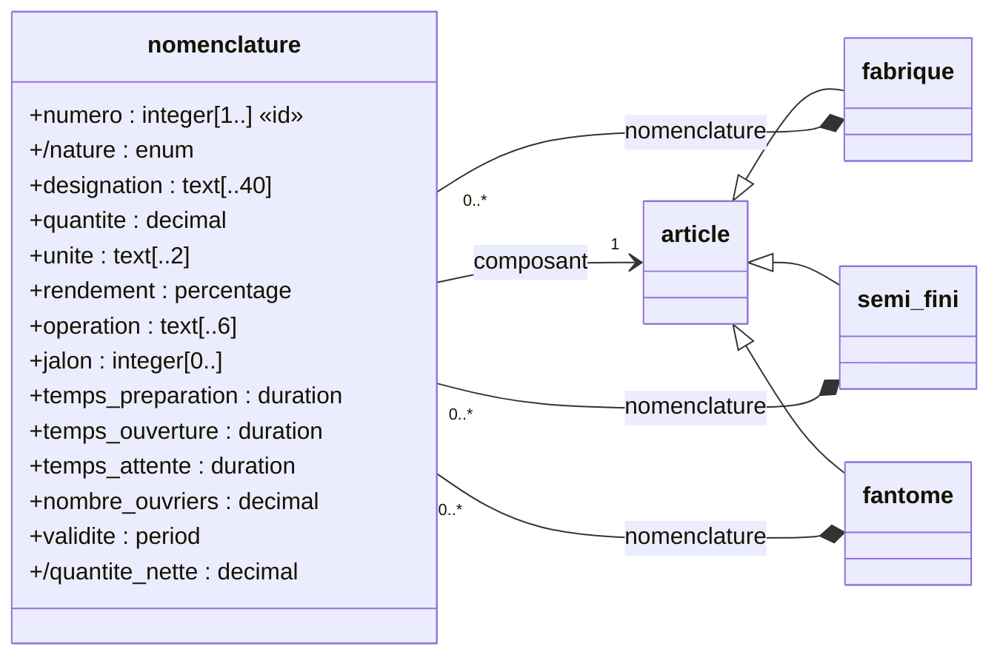

# La documentation générée par Syncytium

Ce document rassemble **les principes de la génération de la
documentation** : ce que Syncytium produit depuis la configuration,
pour qui, à partir de quoi, sous quelle forme, et ce que le technicien
peut y ajouter. C'est le quinzième artefact préparatoire de la
documentation (Q58, le domaine 6 — D602), après
[configuration.md](configuration.md) (D994) et
[migration.md](migration.md) (D1028) ; il est ouvert le 04/10/2026
(D1118). **Il centralise les principes ; chaque artefact garde ce que
son élément apporte à la documentation** — l'entité et ses champs dans
[entity.md](entity.md), les hooks et leur `describe` dans
[hooks.md](hooks.md), les connecteurs dans
[connectors.md](connectors.md), les dépendances dans
[security.md](security.md), les rapports de la reprise dans
[migration.md](migration.md). Les décisions citées renvoient à la
[conception](conception.md). Les sections marquées *en proposition*
sont miennes, jusqu'à leur arbitrage.

## 1. Le principe — trois documentations, trois sources, une seule version

**« La description et l'autogénération de la documentation sont un
des piliers du projet »** (D810). Le méta-schéma et la configuration
construisent en automatique, autant que possible (D333) :

1. **une documentation technique** — ce que l'application est : son
   modèle, ses règles, ses droits, ses connecteurs, ses hooks, ses
   dépendances, ses versions ;
2. **les masques d'explication** (D209) — l'aide en ligne tissée dans
   l'application : la description de la surface et celles des champs
   affichés, à la première consultation ou sur sollicitation ;
3. **une documentation fonctionnelle** — ce que l'application fait,
   dite dans la langue de l'utilisateur.

Elle a **trois sources** :

1. **la documentation rédigée en amont** (D314/Q58) — celle de
   Syncytium lui-même (les artefacts de `docs/`, les cas d'usage) et,
   pour chaque hook, **le fichier md de son fonctionnement** (D778) :
   la brique humaine ;
2. **les descriptions de la configuration** (D810 — `description:`
   partout) : le libellé, l'aide courte, l'aide longue, la valeur de
   démonstration de chaque élément (D124/D258/D840), les notes de
   version (D1112), et **ce que le moteur sait sans qu'on l'écrive** —
   les types et leurs facettes, les validations, les droits, le
   modèle de données en diagrammes (D1119), les écarts entre deux
   versions (D1112), le registre des traitements (D698), les
   dépendances (D924) ;
3. **les données de l'instance** (D334) — l'usage ou le non-usage des
   valeurs et des plages, la télémétrie (D38–D51, la diversité
   D46/D48) : **le modèle dit ce qui est permis, la base dit ce qui est
   fait**.

Et une règle qui les tient ensemble : **la documentation se construit
dynamiquement, version par version** (D645/D810) — *la version
documentée est exactement la version servie* ; rien à rédiger à part,
rien à oublier. Elle vit avec le modèle et ne se périme jamais (D333).
**Par défaut, sans configuration** (D1090) : `documentation.yml` ne
vient que pour la personnaliser.

Ses lecteurs ne sont pas que des humains : les descriptions sont
**« exploitables par des IA »** (D124) — le module de chat lit les
données et les descriptions sous les droits de l'utilisateur (D957), le
cas 7 fait générer la configuration par l'IA (D1023).

## 2. Le carburant — ce que la configuration apporte

Tout élément de configuration porte sa description, en ligne ou par
fichier (D810/D767). **Ce que la documentation doit porter s'écrit en
propriété, jamais en commentaire** (D1100) : le commentaire YAML est
pour le lecteur du fichier, la propriété pour la documentation.

| L'élément | Ce qu'il apporte | Décisions |
|---|---|---|
| le projet (`syncytium.yml`) | `name:`, `description:` ; la version du format `from:` ; le dossier `resources/` (logos, icônes) | D322, D346, D1083 |
| l'environnement | sa `description:` (la nature : la vie courante, le développement), son `storage:`, ses connecteurs | D1090, D1094 |
| la version | les `release-notes:` — **l'évolution fonctionnelle, écrite par le technicien** ; les `languages:` ; les écarts calculés par Syncytium | D1101, D1112 |
| le module | `name:` l'invariant ; `title:` le nom d'usage par langue, `hint:`, `description:` | D416, D1120 |
| l'entité | `name:` l'invariant ; `title:` le nom d'usage par langue ; `label:` (le gabarit du visage), `hint:`, `description:`, l'identité, les états et leur graphe, les validations (`description:`/`message:`), l'historisation, le `rgpd:` | D843, D1116, D1120 |
| le champ | le type et ses facettes, `label:`, `hint:` (la courte), `description:` (la longue, en Markdown — D1102), `placeholder:`, `required:`, `default:`, les validations, la confidentialité, les `allow:`, le `rgpd:`, `unchanged:`, `from:` (le renommage), `deprecated:` (le remplacement ou l'abandon, obligatoire) | D124, D258, D650, D840, D941, D1111 |
| les opérations | leur `description:`, leur contrat et son degré | D148–D152, D699 |
| les surfaces (`gui:`) | la `description:` de la surface → le masque d'explication | D209, D438 |
| les groupes | la `description:` affichée | D414, D1099 |
| les connecteurs | `description:` + `describe()` — ce que la classe dit d'elle-même | D630 |
| les hooks | `describe()` + le fichier md du fonctionnement ; **le hook d'interface est listé** pour que l'administrateur sache quel code tourne chez ses utilisateurs | D645, D778, D918 |
| la reprise | la `description:` des sources et de leurs colonnes (D1100–D1102), celle des règles et de leurs affectations (D1105) | D1100–D1106 |
| le moteur | ses dépendances et leurs versions | D924 |

**Les textes par langue** (D1101) : une seule langue au modèle → les
textes en texte simple ; plusieurs → la langue précisée, sinon une
erreur d'ingestion. La documentation suit : *une édition par langue
déclarée* (ma lecture, §11).

## 3. Les lecteurs *(en proposition)*

D334 nomme quatre destinataires au-delà du technicien : **les
utilisateurs, les techniciens de parties tierces, les usagers**, et
pose le principe du partage **sous les règles d'accès existantes** —
le destinataire ne voit que ce que ses droits permettent
(l'interprétation consignée à D334). D1119 ajoute **le décideur**, qui
perçoit le modèle sans en lire les tables. Je lis sept lecteurs :

| Le lecteur | Ce qu'il cherche | Où il le trouve |
|---|---|---|
| **le technicien** de l'application | le modèle complet, les règles, les écarts entre versions, les hooks, la reprise | la documentation technique |
| **l'administrateur** | les connecteurs et leur état, les dépendances, le code tiers servi au navigateur, le registre des traitements, les groupes et les droits | la documentation technique — la part d'exploitation |
| **l'utilisateur** (l'opérateur) | ce que fait chaque écran, chaque champ, chaque opération, dans sa langue ; le modèle de son module, en image | les masques d'explication, la documentation fonctionnelle |
| **le décideur** | ce que l'application couvre, comment les choses se tiennent — en une image | la vue d'ensemble du modèle (§5), les notes de version |
| **le technicien tiers** (le consommateur des API) | le contrat de chaque version publiée, les champs exposés, les exemples d'appel | la documentation de l'API |
| **l'usager** (la personne dont les données sont traitées) | ce que l'application sait d'elle, pourquoi, combien de temps | le registre des traitements, sous l'angle RGPD |
| **l'assistant IA** | le mode d'emploi filtré par les droits, les descriptions | la même matière, servie au chat (D957–D958) |

Une seule matière, des vues : **la documentation n'est pas un document,
c'est une projection de la configuration pour un lecteur et des
droits** — la même machinerie que la télémétrie (D44 : « Syncytium se
décrit lui-même »).

## 4. La documentation technique *(le plan, en proposition)*

Ce que l'application est, à une version donnée. Les noms sont ceux de
la configuration (la langue du modèle — D335), les types ceux du
catalogue.

1. **Le projet** — le nom, la description, la version du format, les
   environnements et ce que chacun câble (le storage, les
   connecteurs — sans leurs secrets, D944).
2. **La version** — le numéro, le statut (son dossier — D338/D340),
   les langues, les notes de version, **les écarts avec la version
   précédente, calculés** (§9).
3. **Le modèle de données** — la vue d'ensemble en diagramme (§5) :
   les entités, groupées par module, et leurs liens.
4. **Les modules** — pour chacun, sa vue du module (§5), ses entités,
   son menu, ses tableaux de bord.
5. **Les entités** — pour chacune : la description, l'identité, le
   visage (`label:`), **sa vue de l'entité** (§5), les états et leur
   graphe, l'historisation, le `rgpd:` ; **la table des champs** (le
   nom, le type et ses facettes, le libellé, l'aide, l'obligation, le
   défaut, la confidentialité, les droits d'écriture) ; les champs
   calculés et leur formule ; les validations (la règle, sa
   description, son message) ; les opérations et leur contrat ; les
   surfaces déclarées.
6. **Les groupes et les droits** — la composition (D1099), le degré
   (D699), la matrice entités × groupes × actions.
7. **Les types personnalisés** (`settings.yml`) et les réglages.
8. **Les connecteurs** — chacun par son `describe()`.
9. **Les hooks** — chacun par son `describe()` et son md ; les hooks
   d'interface signalés (D918).
10. **La reprise** — les sources lues et ignorées, leurs colonnes
    décrites, les règles et leurs destinataires (migration.md).
11. **L'exploitation** — le journal, le nettoyage, les opérations
    périodiques, les dépendances du moteur (D924), le registre des
    traitements (D698).
12. **L'API** — le contrat de la version pour le technicien tiers (§10).

## 5. Le modèle de données — la représentation graphique (D1119)

**« Il faut ajouter un volet "modèle de données" de type UML pour
faciliter la lecture » ; « le modèle de données, au-delà d'une
description littérale, est à représenter graphiquement pour que le
modèle soit facilement perceptible par un opérateur ou un
décideur. »** (l'auteur, le 04/10/2026). Le modèle se lit donc deux
fois : en tables (§4) et en diagrammes — et le diagramme s'adresse
aussi à ceux qui ne liront jamais la table.

**Acquis** : un volet « modèle de données », graphique, de type UML,
**calculé depuis la configuration** — rien à dessiner, le modèle est
déjà là (le patron des écarts, D1112) ; pour le technicien,
l'opérateur et le décideur.

*En proposition :*

**Le diagramme de classes, en trois niveaux de lecture.**

| Le niveau | Ce qu'il montre | Pour qui | Où |
|---|---|---|---|
| **la vue d'ensemble** de la version | une boîte par entité, groupée par module (le paquetage) ; les liens — l'héritage, la composition, la référence ; **ni champ, ni nom de lien** ; **un seul trait entre deux entités**, quel que soit le nombre de champs qui les relient | le décideur ; l'opérateur qui découvre | en tête de la documentation fonctionnelle et de la technique (§4, chapitre 3) |
| **la vue du module** | ses entités avec leurs champs ; les entités des autres modules qu'il référence, en boîtes vides marquées de leur module | l'opérateur du module ; le technicien | le chapitre du module |
| **la vue de l'entité** | l'entité et son voisinage immédiat : son parent et ses dérivés, ses compositions, ce qu'elle référence, ce qui la référence, ses associations dérivées, les noms des liens | le technicien ; l'opérateur, pour une entité | le chapitre de l'entité |

**La correspondance** (la table détaillée, propriété par propriété,
dans [entity.md](entity.md)) : le module → le paquetage ; l'entité →
la classe, le parent abstrait en italique (D1035) ; `inheritance:` →
la généralisation ; le champ → l'attribut `nom : type` ; la
confidentialité → **la visibilité UML** (`+` public, `#` protected, `-`
private — D358) ; `formula:` → **l'attribut dérivé** `/nom` ;
`identity:` → les attributs marqués `{id}` ; `type: <entité>` →
l'association dirigée, `1` ou `0..1` selon `required:` ; `type: list of
<entité>` → **la composition** `0..*` ; `type: association with …` →
l'association dérivée, en pointillé, `/nom` — aux vues du module et
de l'entité seulement ; les opérations → le compartiment des
opérations ; `states:` → **un diagramme d'états** à part, les valeurs
du statut et les passages permis (D422) — le véhicule (cas 3) en a un.

**L'édition fonctionnelle** (§6) montre les mêmes diagrammes avec les
libellés des champs à la place des noms, sans les types ni les
visibilités ; **l'édition technique** (§4) les montre tels quels.

**La forme** : un langage de diagramme textuel dans l'édition Markdown
— lisible dans le dépôt, diffable, rendu par GitHub et les
visionneuses — et l'image (SVG) dans l'édition HTML, exportable vers
une présentation. **Mermaid** (`classDiagram`, `stateDiagram-v2`) est
ma préférence, PlantUML l'alternative ; le choix de l'outil relève du
domaine 7, le principe — textuel et image, calculé — de celui-ci.

**Le nom d'usage — `title:` (D1120).** `name:` est l'invariant du
module et de l'entité, quelle que soit la langue (D124/D335) ; `label:`
le gabarit d'*un enregistrement* (« `{code} — {libelle}` »). **`title:`
et `description:`, déclinés par langue, complètent `name:`** : le
`title:` est le texte que montrent l'entrée de menu par défaut (D186),
la vue d'ensemble fonctionnelle et les titres de la documentation —
« Produit fabriqué », « Ligne de nomenclature » ; texte simple à une
langue, par langue à plusieurs (D1101) ; sans lui, le `name:`. *Mes
lectures* : au singulier, le pluriel n'est pas une propriété ; le même
`title:` que celui des surfaces.

**La vue d'ensemble du cas 5**, telle que Syncytium la calculerait —
dix-huit entités, quatre paquetages, un trait par couple ; les
associations dérivées (`commandes_vente`, `mouvements`…) n'y figurent
pas. *(Écrit en Mermaid, non rendu : la syntaxe se valide au premier
rendu.)*

```mermaid
classDiagram
  direction LR
  namespace technique {
    class article
    class fabrique
    class semi_fini
    class fantome
    class nomenclature
  }
  namespace tiers {
    class tiers
    class client
    class fournisseur
    class adresse
    class contact
  }
  namespace commande {
    class commande_vente
    class ligne_vente
    class commande_achat
    class ligne_achat
  }
  namespace stock {
    class depot
    class emplacement
    class niveau
    class mouvement
  }
  article <|-- fabrique
  article <|-- semi_fini
  article <|-- fantome
  tiers <|-- client
  tiers <|-- fournisseur
  fabrique *-- "0..*" nomenclature
  semi_fini *-- "0..*" nomenclature
  fantome *-- "0..*" nomenclature
  nomenclature --> "1" article
  article --> "0..1" fournisseur
  article --> "0..1" depot
  article --> "0..1" emplacement
  fabrique --> "0..1" client
  tiers *-- "0..*" adresse
  tiers *-- "0..*" contact
  commande_vente --> "1" client
  commande_vente *-- "0..*" ligne_vente
  ligne_vente --> "1" article
  commande_achat --> "1" fournisseur
  commande_achat *-- "0..*" ligne_achat
  ligne_achat --> "1" article
  emplacement --> "1" depot
  niveau --> "1" article
  niveau --> "1" depot
  niveau --> "1" emplacement
  mouvement --> "1" article
  mouvement --> "0..1" depot
  mouvement --> "0..1" emplacement
```

**La vue de l'entité `nomenclature`** (le cas 5) — ses quinze champs,
l'identité, les deux calculés, ses trois possesseurs, l'article qu'elle
référence. *(UML écrit `{id}` ; Mermaid n'accepte pas l'accolade dans
une classe, l'exemple écrit `«id»`.)*



Le tiny (§13) donne la plus petite vue possible : le paquetage
`annuaire`, la classe `personne`, quatre attributs, deux `{id}`.

## 6. La documentation fonctionnelle *(en proposition)*

Ce que l'application fait, pour celui qui s'en sert. **Les libellés
remplacent les noms, la langue de l'utilisateur remplace celle du
modèle** ; ni type, ni stockage, ni formule — ce qu'un champ *est*, pas
comment il se calcule.

- **L'application** — sa description, **la vue d'ensemble du modèle**
  (§5), ses modules et ce que chacun sert ; ce qui a changé à cette
  version : les notes de version (D1112), en langage d'usager.
- **Chaque module** — sa vue du module (§5), ses écrans (les listes,
  les formulaires, les tableaux de bord), dans l'ordre du menu.
- **Chaque écran** — sa description, les champs qu'il montre et leur
  aide (la matière du masque d'explication, posée), les opérations
  offertes et ce qu'elles font, les états et les passages permis.
- **Ce que l'utilisateur ne voit pas** n'y figure pas : la
  confidentialité et les droits filtrent la documentation comme ils
  filtrent l'écran (D334).

## 7. Les masques d'explication (D209)

Acquis : à la **première consultation ou sur sollicitation** d'une
surface — liste, formulaire, widget de résumé, widget de synthèse —, le
masque présente **la description de la surface** et **reprend les
descriptions des champs affichés** (D124) ; les descriptions déclarées
sont l'aide en ligne, sans rédaction séparée. La première consultation
se mémorise au profil (l'interprétation de D209). Le `hint:` (D840) est
l'aide courte, au « (?) » du champ, sur les trois écrans (D262).

*Mes lectures à confirmer* : le masque est **la documentation
fonctionnelle de l'écran, servie en place** — même matière, même
langue, mêmes droits ; une surface sans `description:` a tout de même
son masque, fait des aides des champs ; un champ sans `description:` y
paraît par son `hint:`, sinon par son libellé seul.

## 8. La troisième source — les données (D334) *(en proposition)*

La documentation technique **exploite les données enregistrées** pour
dire l'usage : la part de valeurs renseignées d'un champ facultatif,
**les valeurs d'un `enum` jamais employées**, les plages réellement
occupées d'un numérique ou d'une date, la diversité représentative
(D46 — un champ constant, candidat au retrait) et scalaire (D48 — un
domaine surdimensionné, à resserrer). Elle ne vit qu'**avec
l'instance** : une documentation générée au dépôt, sans base, n'a pas
cette section ; la documentation servie par l'application l'a. *À
trancher* : sur quels types et quels indicateurs (la liste des canaux
de telemetry.md), et si cette part reste au technicien ou se partage.

## 9. Les écarts entre versions (D1112) *(la forme, en proposition)*

**Syncytium calcule les écarts et les présente ; le technicien ne les
décrit pas** — la description d'un champ dit ce qu'il est, jamais ce
qui a changé ; les notes de version disent le sens fonctionnel.
La documentation d'une version porte donc deux textes : *les notes de
version*, écrites, et *« ce qui change »*, calculé depuis la version
précédente du même statut ou de la chaîne (D4/D323) : les modules,
entités et champs **ajoutés**, **renommés** (`from:` — D1111),
**retypés**, **supprimés** ou **dépréciés** (D650 — avec leur
remplacement), les validations et les droits modifiés. Pour le
technicien tiers, la même liste dit ce que son contrat perd ou gagne
(D11–D13, D98–D99).

## 10. La documentation de l'API *(en proposition)*

D334 : « les techniciens de parties tierces — les consommateurs des
API, dont la documentation générée s'enrichit ». Pour chaque version
**publiée** (D99), la documentation donne, par entité : les champs
exposés (D20 — la politique d'exposition), les opérations, les
exemples d'appel — la lecture, la création, la modification, la
suppression, la recherche — tels que le tiny les montre (D1026),
l'épinglage de version (D98). **La forme** (un format standard de
description d'API, les exemples en `curl`) relève de l'architecture
technique (D1025) ; le principe — l'API documentée depuis le modèle,
version par version — est acquis.

## 11. Les formats et le support *(en proposition)*

- **Les formats** : Markdown et HTML (D630 — « markdown/html pour la
  documentation automatique de l'instance ») ; le PDF par l'impression
  (D53/D187), s'il est demandé ; les diagrammes en texte dans le
  Markdown, en SVG dans le HTML (§5).
- **Deux moments** : *au dépôt* — depuis la configuration seule, par
  une commande (`syncytium document …`, à nommer), le résultat en
  fichiers dans un dossier (la documentation se diffe et se versionne
  avec le dépôt du client — D336) ; *dans l'application* — servie par
  l'instance, sous les droits du lecteur, enrichie des données (§8),
  comme une surface du socle (le patron de `_migration[suivi]` ou du
  module de chat — D1029).
- **Une édition par langue** déclarée (D1101) ; la documentation
  technique dans la langue du modèle, la fonctionnelle dans celle du
  lecteur.
- **Les descriptions sont en Markdown** (D1102 — les tableaux des codes) ;
  `label:`, `hint:`, `placeholder:` en texte simple.

## 12. `documentation.yml` — la personnalisation (D1090) *(en proposition)*

Facultatif ; référencé par la clé `documentation:` de l'environnement
(configuration.md §3.2). Il porterait : le dossier et les formats de
sortie ; les sections retenues ou écartées ; l'identité visuelle
(`resources/` — D346) ; **des pages ajoutées** par le technicien (un
guide de démarrage, une page d'accueil, en Markdown — `~{…}`), placées
dans le plan ; les destinataires d'une diffusion périodique, s'il y en
a. *Rien n'est obligatoire* : le tiny n'en a pas.

## 13. Le tiny, la maison de la documentation (D1026)

Le cas 1 (`examples/01_tiny/`, `usecases/01_tiny.md`) **montre** ce qui
naît de quelques lignes : la base, l'IHM par défaut (D186), l'API, la
documentation, les aides. **La méthode de ce chantier** *(en
proposition)* : écrire à la main, pour le tiny, **la documentation que
Syncytium devrait générer** — la technique, la fonctionnelle, le masque
de la liste `personne`, la page d'API, le diagramme — comme on a écrit
les exemples avant le moteur ; chaque frottement de cette écriture =
une décision ; puis la même épreuve sur une entité du cas 5 (l'article
et sa hiérarchie, la reprise) pour les écarts, les droits et la
troisième source.

## 14. Les points ouverts

1. les lecteurs (§3) et la part de chacun ;
2. le plan de la documentation technique (§4) et de la fonctionnelle
   (§6) ;
3. la représentation graphique (§5) : les trois niveaux, la
   correspondance, la forme (Mermaid, PlantUML) ; le `title:` au
   singulier ;
4. les lectures du masque d'explication (§7) ;
5. les indicateurs de la troisième source et leur partage (§8) ;
6. la forme des écarts calculés (§9) ;
7. la documentation de l'API — le principe ici, la forme au domaine 7
   (§10) ;
8. les deux moments et le nom de la commande (§11) ;
9. les propriétés de `documentation.yml` (§12) ;
10. la méthode : la documentation attendue du tiny, écrite à la main
    (§13).
